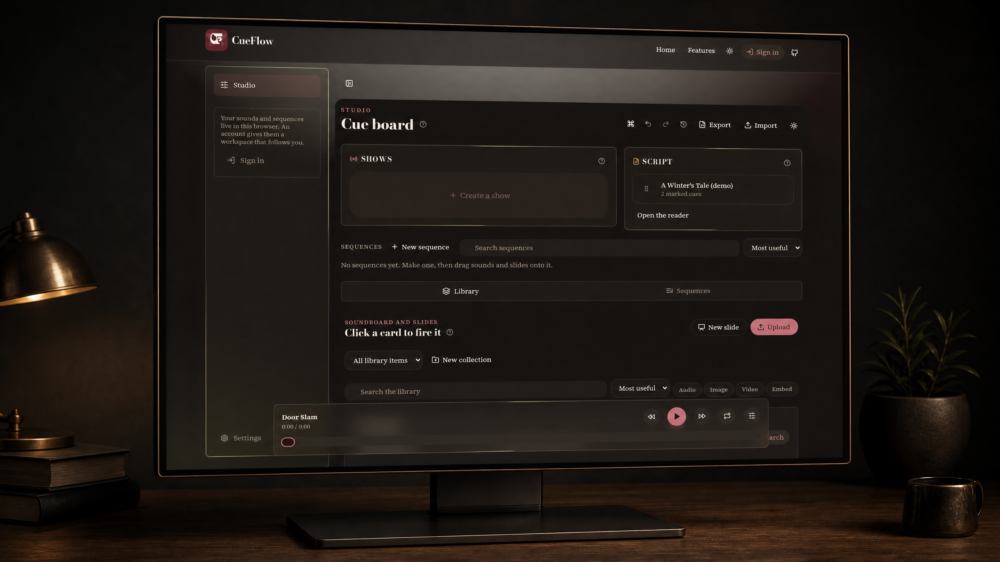
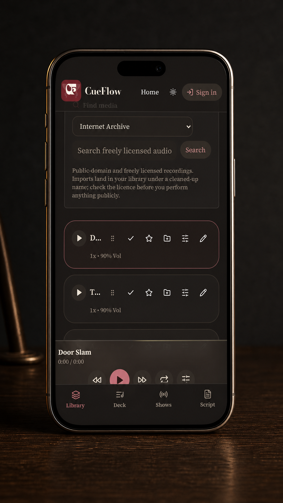
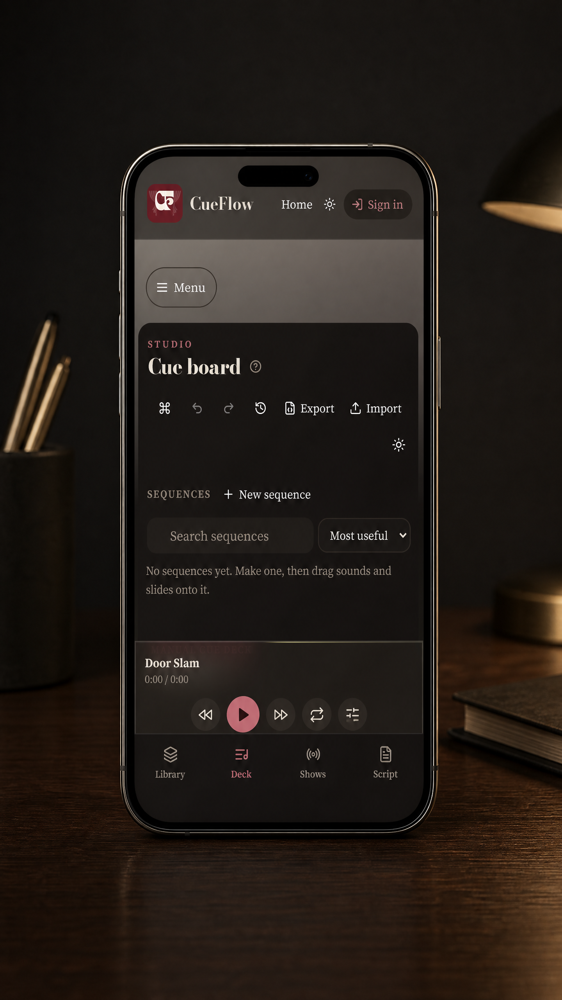

# CueFlow

**Stand by. Go.**

A cue board that runs in a browser tab. Every sound and every slide in your show sits in one
numbered list, and one keypress sends the next thing on it to a second screen the audience sees.

Nothing plays on a timer. Nothing plays until you call it.

**[cuefloww.netlify.app](https://cuefloww.netlify.app)** · no install, no account needed to try it

---

## Why it exists

School and community productions run on whatever is to hand: a laptop with a media player, someone
scrubbing a timeline in the dark, a slide deck in another window and a phone with the script on it.
Four things to watch, four things to get wrong.

A professional desk solves this by holding the sequence and letting one person call it. That is
the only part CueFlow copies. It keeps the list; you keep the timing.

## What it does

**One library, four kinds of thing.** Audio, images, video and typed slides, with a real editor for
each, trim and level a sound, crop and grade a picture, cut a video down to the eight seconds you
need, compose a title card. All of it happens in your browser. Nothing is uploaded to be processed.

**Two runs of numbers.** Sound counts `1, 2, 3`. Anything the room sees counts `a, b, c`. "Play 3"
and "put up b" can never be confused over comms, which is the entire reason theatre numbers them
separately.

**Cues that fire in pairs.** Link a slide to the sound underneath it and one keypress sends both,
while the deck's position stays on the cue you actually called.

**A script that warns you.** Import a Word or PDF file and it keeps the writer's formatting and loses
the paper. Name the words that matter and the screen flashes amber shortly *before* each one arrives,
then red as it lands. Never a sound, you are standing a few feet from an audience.

**Shows across every device in the room.** Hand out a key and the rest of the crew join on their own
phones. No accounts. Each job's key decides what that person sees and can do; the show password gets
you in as a collaborator. Messages between devices flash on screen and are silent by design.

**Projects.** A separate library, sequences, script and shows per production, with collaborators
added by username or email.

## Screens

CueFlow is designed for dark rooms, quick handoffs and screens that stay legible when the show is moving.
These are the working app screens in the dark theme.







## Running it yourself

```bash
npm install
npm run dev
```

Copy `.env.example` to `.env` and fill in a Supabase URL and publishable key if you want accounts and
cloud sync. Without them everything still works, saved to the browser.

```bash
npm test          # vitest
npm run build     # production bundle into dist/
```

## Built with

React, TypeScript, Vite, Tailwind v4 and HeroUI. Web Audio for the sound editing, Canvas for the
pictures and slides, `pdfjs` and `mammoth` for script import, Supabase for accounts, storage and the
realtime channel a show runs on.

## Standing on other people's shoulders

The editors were built by studying how the good open-source tools behave, not by copying their code
they are GPL and this is not, so the debt is behavioural, and it is acknowledged in full on the
[Credits page](https://cuefloww.netlify.app/credits): **Audacity** and **Audiomass** for the sound
editor, **darktable** and **Krita** for the order and naming of the picture controls, **OpenCut** for
the video trim, **pptWeb** for the slide composer.

Media search covers the **Internet Archive**, **Wikimedia Commons** and **Openverse**, all of which
are free to redistribute. There is deliberately no YouTube, Spotify or Apple Music import: those
catalogues are licensed rather than free, and the protected ones cannot be extracted without
circumventing access controls. See [/terms#imports](https://cuefloww.netlify.app/terms#imports).

## Licence

MIT.
